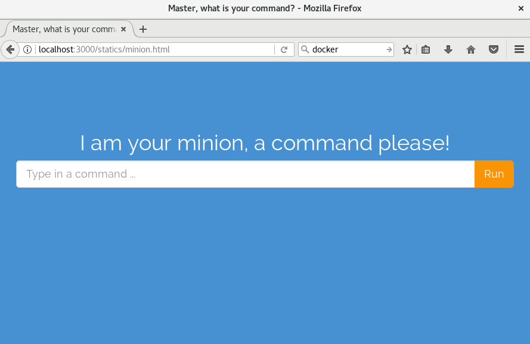

================================================================================
Minion
================================================================================

.. image:: https://api.travis-ci.org/chfw/Minion.svg?branch=master
   :target: http://travis-ci.org/chfw/Minion

.. image:: https://codecov.io/github/chfw/Minion/coverage.png
    :target: https://codecov.io/github/chfw/Minion

Installation
================================================================================

You can clone it and install it:

.. code-block:: bash

    $ git clone http://github.com/chfw/Minion.git
    $ cd Minion
    $ python setup.py install

Evaluation
================================================================================

After installation, you can evalute it from current Minion directory:

.. code-block:: bash

    $ minion public/
    * Running on http://0.0.0.0:3000/ (Press CTRL+C to quit)

Please then visit http://localhost:3000/statics/minion.html to send commands.

Evaluate it in docker
================================================================================

After you have finished previous two steps, please run this docker command:

.. code-block:: bash

    $ docker build -t minion .

Once the image was built, please run it:

.. code-block:: bash

    $ docker run -p 4000:3000 minion

Please then visit http://localhost:4000/statics/minion.html to send commands.

.. note::

   You may need to run those commands with `sudo` prefix.

Additional Infomration
================================================================================

`Yehua <https://github.com/chfw/yehua>`_ and
`moban<https://github.com/chfw/moban>`_ are used as the scaffolding tool to
create the initial commit in 2 seconds.

